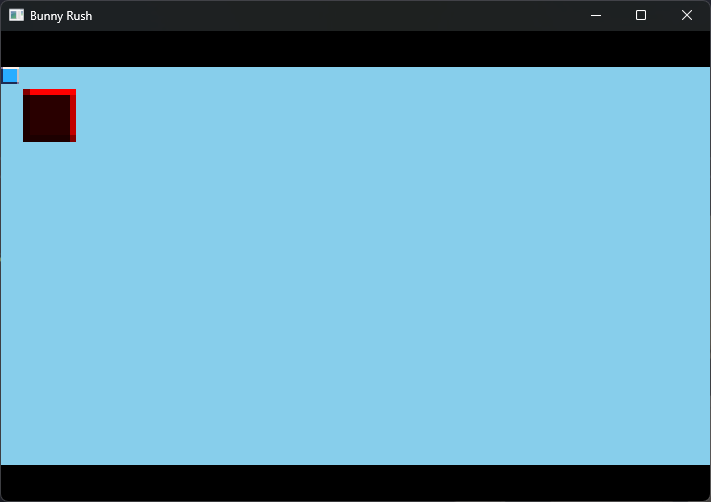

# Pride
Pride is a small SDL wrapper written in C++ for my own projects.

> [!IMPORTANT]
> This project is not meant for outside use.
> It is only meant for my own projects.
> I do not guarantee any stability or any quality!

# Example
The below example creates a Celeste-Like renderer and draws two boxes inside of it.
```cpp
#include <SDL3/SDL.h>

#include <pride/game.h>
#include <pride/vec2.h>
#include <pride/renderer.h>
#include <pride/colour.h>

int main()
{
	Pride::Math::Vec2 game_size = Pride::Math::Vec2(320, 180);
	Pride::Game game = Pride::Game();

	game.set_config_flags(SDL_WINDOW_VULKAN | SDL_WINDOW_RESIZABLE);
	if (!game.create_window("Bunny Rush", game_size * 3)) return -1;

	Pride::Renderer renderer = Pride::Renderer(&game);
	if (!renderer.create(game_size)) return -1;

	SDL_Texture* texture = game.content.load_texture_relative("Content/wall.png", SDL_SCALEMODE_NEAREST);

	while (!game.window_should_close())
	{
		// Update 
		// ----------------
		game.poll_events();

		// Draw
		// ----------------

		// Draw inside window world
		game.clear(Pride::Colours::Black);

		// Draw inside the renderer
		renderer.attach();
		game.clear(Pride::Colours::SkyBlue);

		// Draw normal texture
		game.draw_texture(
			texture, Pride::Math::Vec2(),
			Pride::Colours::White
		);

		// Draw texture scaled and red
		game.draw_texture(
			texture, Pride::Math::Vec2(10, 10),
			3.0f, Pride::Colours::Red
		);

		// Draw the renderer in the window world
		renderer.detach_and_draw();


		// Advance to the next frame
		game.advance_frame();
	}

	renderer.destroy();
	SDL_DestroyTexture(texture);

	game.close_window();
}
```


# License
GPL 3.0