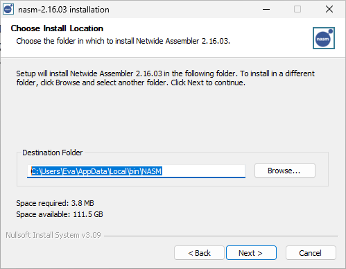

# Pride
Pride is a small SDL wrapper written in C++ for my own projects.

> [!IMPORTANT]
> This project is not meant for outside use.
> It is only meant for my own projects.
> I do not guarantee any stability or any quality!

# Example
The below example creates a Celeste-Like renderer and draws two boxes inside of it.

```cpp
class Game : public Pride::Game
{
public:
  Game() : Pride::Game("My Game", 800, 600)
  {
    this->m_flags = SDL_WINDOW_VULKAN | SDL_WINDOW_RESIZABLE;
  };

  // This is a required function.
  void initialise() override
  {
    // Initialise renderer.
    // NOTE: The renderer is not usable yet.
    this->m_renderer = std::make_unique<Pride::Renderer>(this);

    // Calling create() makes the renderer usable.
    this->m_renderer->create(320, 180);

    this->content.register_asset_relative("box", std::filesystem::path("Content/box.png"))
  }

  // This is a required function.
  void process(float delta) override
  {
  }

  // This is a required function
  void render() override
  {
    // Drawing inside window world
    this->drawables.clear(Pride::Colours::Black);

    // Drawing inside renderer world
    this->m_renderer->attach();
    this->drawables.clear(Pride::Colours::SkyBlue);

    // Draw normal texture
    game.draw_texture(
      this->content.assets["box"],
      Pride::Math::Vec2(),
      Pride::Colours::White
    );

    // Draw texture scaled and red
    game.draw_texture(
      this->content.assets["box"],
      Pride::Math::Vec2(10, 10),
      3.0f, Pride::Colours::Red
    );

    // Drawing the renderer.
    this->m_renderer->detach_and_draw();
  }

  // This is an optional function.
  void leave() override
  {
    this->m_renderer->destroy();
  }

private:
  std::unique_ptr<Pride::Renderer> m_renderer = nullptr;
};

```


# Building Pride from scratch.

 

## Linux
 

Soon...
 


 

## Windows
 

### Before we begin...
 

You'll need to install git, NASM, Perl and VS2022.
 

First, download the windows *standalone installer* from the [git site](https://git-scm.com/downloads/win).
 


 

Now, head over to [NASM installer site](https://www.nasm.us/pub/nasm/releasebuilds/2.16.03/win64) and download the installer.
 


 

Please keep note of the Path you have selected for installation, we will need it later.
 


 

Next, you must add that path to your system's PATH. You can follow [this tutorial](https://www.architectryan.com/2018/03/17/add-to-the-path-on-windows-10).
 


 

After that, you must download Perl. Head over to their [site](https://strawberryperl.com). Download the latest MSI.
 


 

Next, you will need VS2022 for the C++ Developer tools. Go to the [VS2022 site](https://visualstudio.microsoft.com/vs).
 


 

Download Visual Studio Community Edition 2022.
 


 

Once you're in the installer, you'll see something akin to this window.
 


 

Select "Desktop development with C++". Click "install" button at the bottom-right corner.
 


 

### Building
 

After the IDE is done downloading, you are free to close it. We will now need to open "Developer PowerShell for VS2022".
 


 

Click "Run as Administrator".
 


 

We will now need to run a few commands.
 

```bash
 

git clone https://github.com/EveMeows/Pride
 

cd Pride
 

```
 


 

Now, we will make use of the C++ tools we just installed.
 

```bash
 

mkdir build; cd build
 


 

# Build without example
 

cmake .. -G Ninja
 


 

# Build with window example
 

cmake .. -G Ninja -DCOMPILE_EXAMPLE=ON
 


 

ninja
 

```
 

Now, you should have Pride.lib in your build dir! That's the library! Good job.
 


 

If you compiled the example, you will also have a `WindowExample` binary.
 


 

Run it with `.\WindowExample.exe`. You should see a window with a blue background. Great!
 


# License
GPL 3.0
